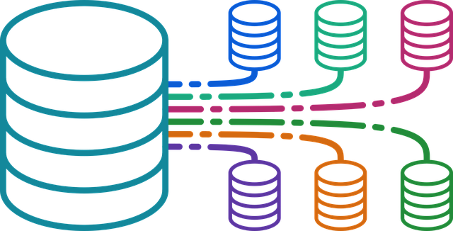
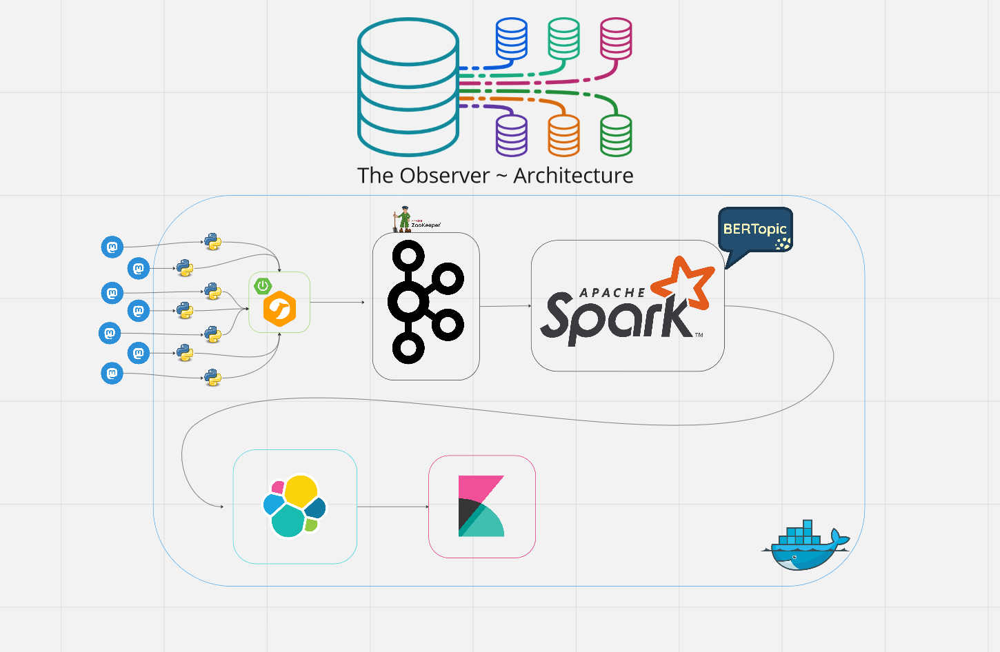
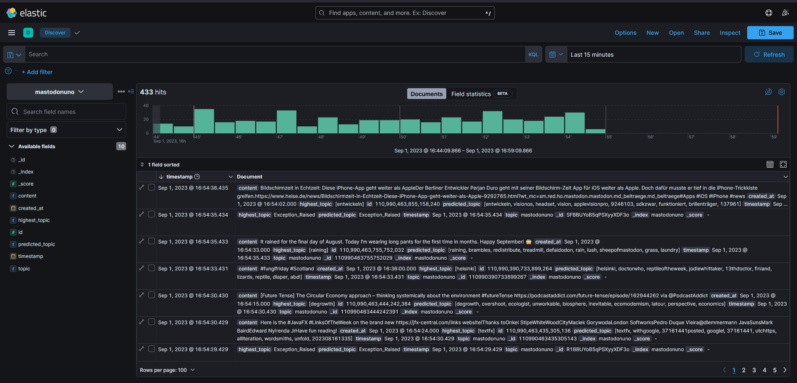
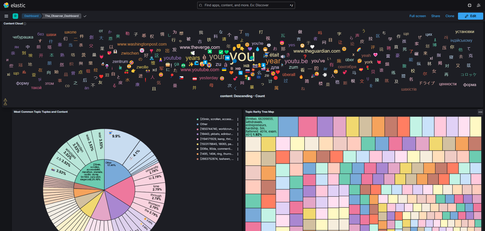

# The Observer

Many of us have experienced long, uninterrupted sessions of scrolling through social media feeds. But has anyone ever paused to ask: what exactly are all these users discussing?

This project seeks to answer that question. Its primary objective is to provide an unbiased, comprehensive analysis of public Mastodon servers by leveraging the capabilities of the `BERTopic` model. The project is designed with an extensible architecture, allowing for flexible and scalable insights into public discourse across these platforms.

-------------------

## Architecture

Miro board [here](https://miro.com/app/board/uXjVMrHQaa4=/?share_link_id=492488903107)



-------------------

## Requirements

| Component     | Version   |
|---------------|-----------|
| Docker        | `20.10.5` |
| Docker-Compose| `1.25.0`  |
| Mastodon API  | `2.0`     |

--------------------

## Setup

Obtain the project

```bash
git clone https://github.com/AndrewDarnall/The-Observer.git
cd The-Observer
```

Run a setup shell script (builds some container images such as Apache Kafka)

```bash
bash ./Scripts/project_setup.sh
```

Build the project (this might take a while)

```bash
docker-compose build
```

Run the project

```bash
docker-compose up
```

-------------------

## Dashboard Configuration

Open your web browser of choice and enter:

```bash
localhost:5601/
```
1) Go to > Saved Objects > Import > TAP_Project/Data_Visualization/saved-objects/dashboard_export.ndjson > click import
2) Reload the page as is
3) Go to dashboard and select the 'the_observer' dashboard

--------------------------

# End Result



--------------------------

